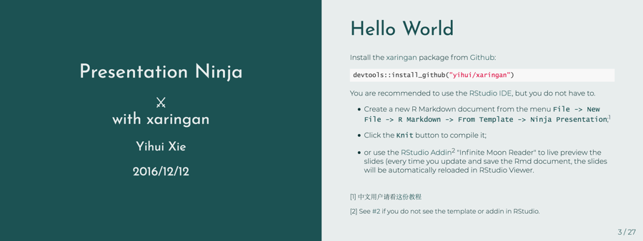
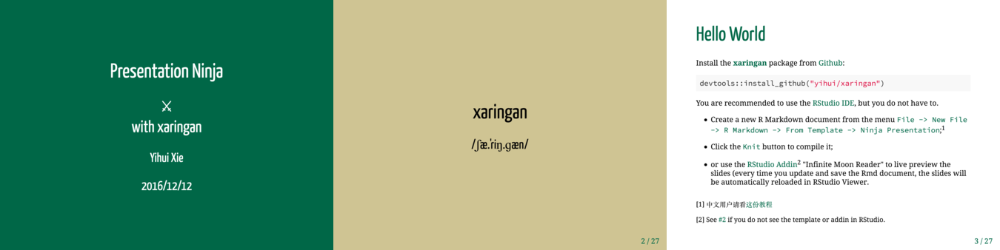
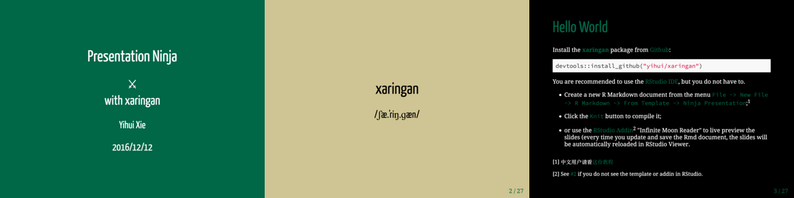

<!-- README.md is generated from README.Rmd. Please edit that file -->

```{r setup, include = FALSE}
knitr::opts_chunk$set(
  collapse = TRUE,
  comment = "#>",
  fig.path = "man/figures/README-",
  out.width = "100%"
)
```
# xaringanthemer

[xaringan]: https://github.com/yihui/xaringan

Easily style your [xaringan] slides with **xaringanthemer**.


```{r toc, results='asis', echo=FALSE, message=FALSE}
devtools::source_gist("c83e078bf8c81b035e32c3fc0cf04ee8", filename = 'render_toc.R')
x <- render_toc("README.Rmd", toc_depth = 3)
gsub("    -", "-", sub("^-.+?\n", "", x))
```

## Installation

**xaringanthemer** lives here on GitHub.

```r
# install.packages("devtools")
devtools::install_github("gadenbuie/xaringanthemer")
```

## Quick Intro

First, add `css: xaringan-themed.css` to your xaringan slides YAML header under `xaringan::moonreader:`.

```yaml
output:
  xaringan::moon_reader:
    lib_dir: libs
    css: xaringan-themed.css
```

Then, in the first knitr chunk, load **xaringanthemer** and try one of the [theme functions](#themes).

````markdown
```{r setup, include = FALSE}`r ""`
options(htmltools.dir.version = FALSE)
library(xaringanthemer)
mono_light(
  base_color = "#1c5253",
  header_font_google = google_font("Josefin Sans"),
  text_font_google   = google_font("Montserrat", "300", "300i"),
  code_font_google   = google_font("Droid Mono")
)
```
````



**xaringanthemer** is <kbd>Tab</kbd> friendly -- [use autocomplete to explore](#fully-customized) the themes!

## Themes

### Monotone

Use these functions to automatically create a consistent color palette for your slides, based around a single color.

#### `mono_light()`

A light theme based around a single color


#### `mono_dark()`

A dark theme based around a single color


#### `mono_accent()`

The default xaringan theme with a single color used for color accents on select elements (headers, bold text, etc.)


#### `mono_accent_inverse()`

An "inverted" default xaringan theme with a single color used for color accents on select elements (headers, bold text, etc.)


    

### Duotone

These themes build from two (ideally) complementary colors.

#### `duo()`

A two-colored theme based on a primary and secondary color.


#### `duo_accent()`

The default Xaringan theme with two accent colors.



#### `duo_accent_inverse()`

An "inverted" default Xaringan theme with two accent colors.



### Solarized

There are also two themes based around the [solarized color palette](http://ethanschoonover.com/solarized), `solarized_light()` and `solarized_dark()`.
For both themes, it is advisted to change the syntax highlighting theme to `solarized-light` or `solarized-dark` (looks great paired or constrasted).

#### `solarized_light()`


#### `solarized_dark()`


To do this, your YAML header should look more-or-less like this:

```yaml
output:
  xaringan::moon_reader:
    lib_dir: libs
    css: ["xaringan-themed.css"]
    nature:
      highlightStyle: solarized-dark
      highlightLines: true
      countIncrementalSlides: false
```

### Fully Customized

The theme functions listed above are just wrappers around the central function of this package, `write_xaringan_theme()`.
If you want to start from the default **xaringan** theme and make a few modifications, start there.

All of the theme template variables are repeated in each of the theme functions (instead of relying on `...`) so that you can use autocompletion to find and change the defaults for any theme function.
To override the default value of any theme functions, set the appropriate argument in the theme function.

As an example, try loading `xaringanthemer`, type out `duo_theme(` and then press <kbd>Tab</kbd> to see all of the theme options.

All of the theme options are named so that you first think of the element you want to change, then the property of that element.

Here are some of the `text_` theme options:

```{r, results='asis', echo=FALSE}
source("R/theme_settings.R")
tvv <- template_variables$variable
cat(paste0("- `", tvv[grepl("^text_", tvv)][1:5], "`"), sep = "\n")
cat("- *and more ...*")
```

And here are the title slide theme options:

```{r results='asis', echo=FALSE}
cat(paste0("- `", tvv[grepl("^title_slide_", tvv)], "`"), sep = "\n")
```

## Fonts

[google-fonts]: https://fonts.google.com

Yihui picked out great fonts for the default **xaringan** theme, but sometimes you want something new and interesting.

**xaringanthemer** makes it easy to use [Google Fonts][google-fonts] in your presentations (well, as long as you have an internet connection) or to fully specify your font files.

To use [Google Fonts][google-fonts], set the `_font_google` theme arguments --
```{r results='asis', echo=FALSE} 
cat(paste0("`", tvv[grepl("_font_google$", tvv)], "`", collapse = ", "))
```
--- using the `google_font()` helper. 
See `?google_font` for more info.

```r
mono_light(
  header_font_google = google_font("Josefin Slab", "600"),
  text_font_google   = google_font("Work Sans", "300", "300i"),
  code_font_google   = google_font("IBM Plex Mono")
)
```

If you set an `xxx_font_google` theme arguments, then `xxx_font_family`, `xxx_font_weight` and `xxx_font_url` are overwritten -- where `xxx` in `{header, text, code}`.
Of course, you can manually set `header_font_url`, etc., and ignore the `header_font_google` argument.

For example, suppose you want to use a ligature font for the code font, such as [Fira Code](https://github.com/yihui/xaringan/issues/83).
Just set `code_font_family` and `code_font_url`!

```r
solarized_dark(
  code_font_family = "Fira Code",
  code_font_url = "https://cdn.rawgit.com/tonsky/FiraCode/1.204/distr/fira_code.css"
)
```

***

**xaringanthemer** was built by [Garrick Aden-Buie](https://www.garrickadenbuie.com) ([&commat;grrrck](https://twitter.com/grrrck)).

Big thank you to [Yihui Xie](https://yihui.name), especially for [xaringan].

Feel free to [file an issue](https://github.com/gadenbuie/xaringanthemer/issues) if you find a bug or have a theme suggestion -- or better yet, submit a pull request!
