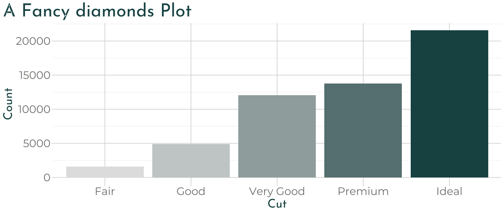

<!-- README.md is generated from README.Rmd. Please edit that file -->

# xaringanthemer 

<!-- badges: start -->

[](https://CRAN.R-project.org/package=xaringanthemer)
[](https://gadenbuie.r-universe.dev)
[](https://lifecycle.r-lib.org/articles/stages.html)
[](https://github.com/gadenbuie/xaringanthemer/actions)
[](https://codecov.io/github/gadenbuie/xaringanthemer)
<!-- badges: end -->

Give your [xaringan](https://github.com/yihui/xaringan) slides some
style with **xaringanthemer** within your `slides.Rmd` file without
(much) CSS.


## Installation

You can install **xaringanthemer** from CRAN

``` r
install.packages("xaringanthemer")
```

or you can install the development version of xaringanthemer from
[GitHub](https://github.com/gadenbuie/xaringanthemer).

``` r
# install.packages("remotes")
remotes::install_github("gadenbuie/xaringanthemer")
```

## Quick Intro

<!-- Set link to theme-settings, template-variables, theme functions -->

First, add the `xaringan-themer.css` file to the YAML header of your
xaringan slides.

``` yaml
output:
  xaringan::moon_reader:
    css: xaringan-themer.css
```

Then, in a hidden chunk just after the knitr setup chunk, load
**xaringanthemer** and try one of the [theme functions](#themes).

```` markdown
```{r xaringan-themer, include=FALSE, warning=FALSE}
library(xaringanthemer)
style_mono_accent(
  base_color = "#1c5253",
  header_font_google = google_font("Josefin Sans"),
  text_font_google   = google_font("Montserrat", "300", "300i"),
  code_font_google   = google_font("Fira Mono")
)
```
````


### Matching ggplot Themes

**xaringanthemer** even provides a
[ggplot2](https://ggplot2.tidyverse.org) theme with `theme_xaringan()`
that uses the colors and fonts from your slide theme. Built on the
[showtext](https://github.com/yixuan/showtext) package, and designed to
work seamlessly with [Google Fonts](https://fonts.google.com).

Color and fill scales are also provided for matching sequential color
scales based on the primary color used in your slides. See
`?scale_xaringan` for more details.

More details and examples can be found in `vignette("ggplot2-themes")`.

``` r
library(ggplot2)
ggplot(diamonds) +
  aes(cut, fill = cut) +
  geom_bar(show.legend = FALSE) +
  labs(
    x = "Cut",
    y = "Count",
    title = "A Fancy diamonds Plot"
  ) +
  theme_xaringan(background_color = "#FFFFFF") +
  scale_xaringan_fill_discrete()
```



### Tab Completion

**xaringanthemer** is <kbd>Tab</kbd> friendly – [use autocomplete to
explore](#theme-settings) the [template
variables](vignettes/template-variables.md) that you can adjust in each
of the themes!


### R Markdown Template in RStudio

You can also skip the above and just create a *Ninja Themed
Presentation* from the New R Markdown Document menu in RStudio.

<center>

</center>

## Features

There’s a lot more that **xaringanthemer** can do! [Discover
xaringanthemer’s
features.](https://pkg.garrickadenbuie.com/xaringanthemer/articles/xaringanthemer.html)
